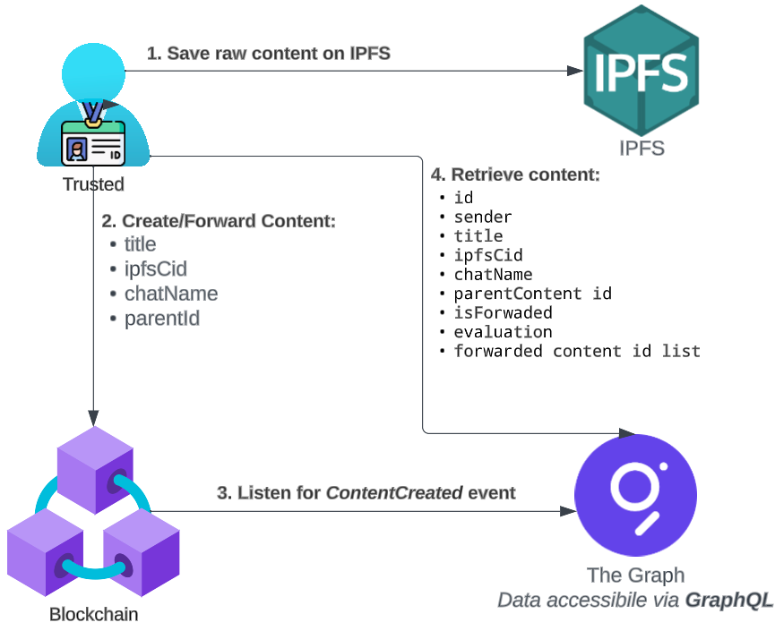
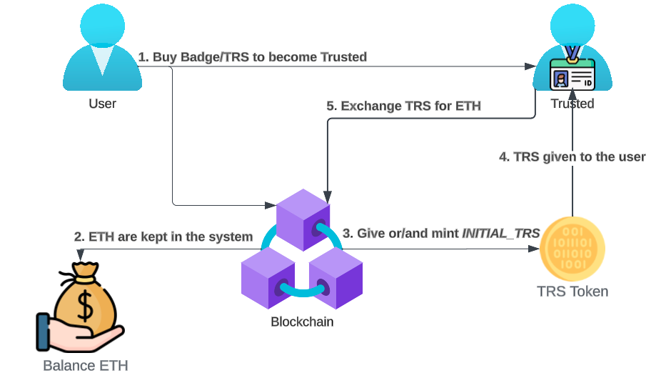
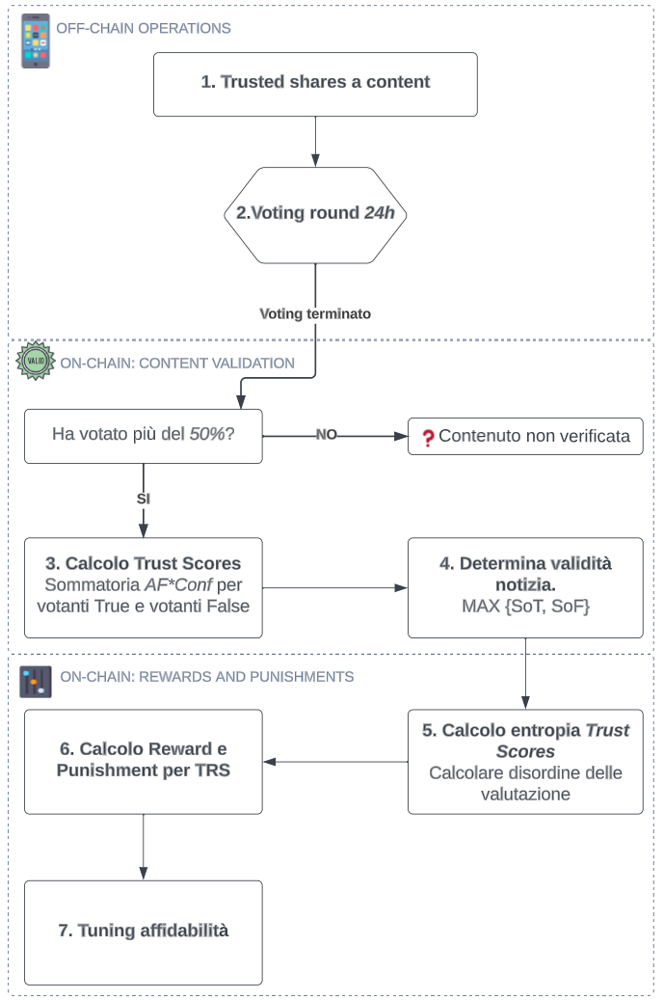

# SocialTrustr
<br>

Thesis project, Computer Science UniBO 22/23

# Introduction

SocialTrustr is a system designed to combat digital disinformation by leveraging blockchain technology with a game theory-based approach and decentralized reputation systems. The platform epitomizes the “wisdom of the crowd” philosophy by enabling each user to actively participate in content validation, incentivized to exhibit honest behavior through a consensus mechanism based on rewards. The decentralized nature and incentive systems based on entropy offer a robust alternative to traditional fact-checking practices, transforming every user into an active validator of online content integrity.

If you want to know more, consult the project thesis [file](tesi.pdf) or the notes taken during the development on [notion](https://manuworks.notion.site/SocialTrustr-39ae07be954f42079c08c67b2321356b?pvs=74)

# Technologies Used

SocialTrustr was implemented using the following key technologies:

- **`Ethereum Smart Contracts`** for handling content sharing, evaluation, and token management.
- **`The Graph`** for creating a specialized API that queries shared content saved on the blockchain, alongside their traceability and final validations.

# Project Structure

### Blockchain Application (`src/` directory)

Contains a set of Smart Contracts that allow users to interact with content sharing, evaluation, and TRS token management functions.

### Smart Contracts Overview:

- **ContentSharing**: Manages storage of shared content through a list of Content Structures containing details such as title, IPFS CID, chat name, whether the content was forwarded, and a timestamp.
- **ContentEvaluation**: Handles functionality related to the user-driven evaluation process of shared content.
- **TrustToken**: Manages the TRS token mechanics and distribution, including staking, rewards, and penalties for content evaluations.

Using Foundry, the development of smart contracts was streamlined. It facilitated operations like managing a local blockchain with Anvil, the development of Solidity-written tests, and creating scripts to interact with deployed smart contracts.

### Subgraph Application (`subgraph/` directory)

A custom API built using The Graph allows for querying shared content, traceability, and related validations. The implementation includes defining the schema, acquiring the data with a subgraph, and processing events from smart contracts to populate the graph.

# System Architecture

The architecture behind SocialTrustr is based on including all user interactions within the Smart Contracts on the Ethereum blockchain. The use of The Graph ensures that interactions are indexed and efficiently queriable. This combination allows for the transparent and immutable recording of actions taken within the platform while keeping the validating and sharing process decentralized.


<details>
	<summary>Schemas Overview</summary>
	<table style="text-align: center;">
		<tr>
			<td>Storage and data flow</td>
			<td>Badge/TRS purchase</td>
		</tr>
		<tr>
			<td>
				
			</td>
			<td>
				
			</td>
		</tr>
		<tr>
			<td>Content validation flow</td>
		</tr>
		<tr>
			<td>
				
			</td>
		</tr>
	</table>
</details>


# How to run

The [**`Makefile`**](Makefile) included in this repository provides a list of commands to run and test the system. It simplifies tasks like compilation, deployment, and interaction with smart contracts. 

You should have [foundry](https://book.getfoundry.sh/getting-started/installation) install. Then run a local development node using anvil:
```bash
$ anvil
```

Below is a list of representative commands that you can use:

- **`make install`**: Install dependecies.
- **`make build`**: Compile smart contracts.
- **`make test`**: Run test suites for smart contracts.
- **`make deploy`**: Deploy smart contracts to local blockchain.

Trust Token:
- **`make buyBadge`**: buy initial TRS Token.
- More commands in the Makefile

Content Sharing:
- **`make shareContent ARGS='...'`**: share new content.
- More commands in the Makefile

Content Evaluation:
- **`make evaluateContent ARGS='...'`**: evaluate a specific content.
- More commands in the Makefile